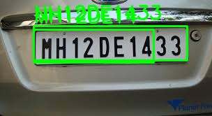

# ANPR - Automatic Number Plate Recognition

A end-to-end Automatic Number Plate Recognition system built using YOLOv8 and EasyOCR.

## What it does
- Detects license plates in images using YOLOv8
- Extracts plate text using EasyOCR
- Post-processes OCR output for Indian plate format
- Outputs annotated image with plate text overlay

## Tech Stack
- **YOLOv8** — Object detection (plate localization)
- **EasyOCR** — Text extraction from plate
- **OpenCV** — Image processing & annotation
- **Python** — Core language

##  Project Structure
anpr-system/
data/          → Test images + output
models/        → Trained YOLOv8 weights (best.pt)
notebooks/     → Development notebooks
src/           → Source code
api/           → API layer


##  How to Run

### 1. Install dependencies
```bash
pip install ultralytics easyocr opencv-python
```

### 2. Run pipeline
```python
from notebooks.test_model import run_anpr

image, plates = run_anpr('data/test_car.jpg')

for plate in plates:
    print(plate['plate_text'])
```

## Results
| Metric | Value |
|--------|-------|
| Detection Confidence | 0.86 |
| Model | YOLOv8n |
| Training Epochs | 50 |
| Dataset | Vehicle Registration Plates v2 (Roboflow) |

##  Sample Output


## Pipeline